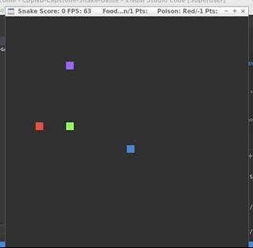
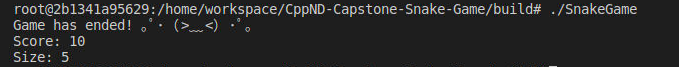
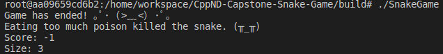

# CPPND: Capstone Snake Game 

This project extends the C++ Nanodegree Capstone project called Snake game in the [Udacity C++ Nanodegree Program](https://www.udacity.com/course/c-plus-plus-nanodegree--nd213). The code for this repo was inspired by [this](https://codereview.stackexchange.com/questions/212296/snake-game-in-c-with-sdl) excellent StackOverflow post and set of responses. 
This project is used to demonstrate principles learnt throughout the C++ Nanodegree Program and shows the implementation of a wide range of C++ features.



### Final terminal screen:


## New features/rules added to the game:
* Enemy rattle snake added with violet head and burnt orange body. 
* If our snake hits enemy snake, snake dies and the game ends. 
* When our snake eats food, along with size of our snake, enemy snake's size also it grows and randomly changes direction, speed stays the same.
* Green Food object added. If our snake eats food, 1 point is added to the score.
* At certain points in the game, you get a yellow bonus food which is worth 10 points.
* There is a timer running that reduces the bonus food points by 1 point every 2 seconds until the points are equal to 1.
* Once bonus is gone, food turns back green. Therefore the quicker you eat the bonus food the more points you get!
* Red Poison object added. If our snake eats poison, 1 point is taken off the score. 
* Poison positions in game are read from a file with random coordinates.
* If our snake eats too much poison, and its score becomes negative, then the snake dies and the game ends.

### Game end after eating too much poison:


## Dependencies for Running Locally
* cmake >= 3.7
  * All OSes: [click here for installation instructions](https://cmake.org/install/)
* make >= 4.1 (Linux, Mac), 3.81 (Windows)
  * Linux: make is installed by default on most Linux distros
  * Mac: [install Xcode command line tools to get make](https://developer.apple.com/xcode/features/)
  * Windows: [Click here for installation instructions](http://gnuwin32.sourceforge.net/packages/make.htm)
* SDL2 >= 2.0
  * All installation instructions can be found [here](https://wiki.libsdl.org/Installation)
  * Note that for Linux, an `apt` or `apt-get` installation is preferred to building from source.
* gcc/g++ >= 5.4
  * Linux: gcc / g++ is installed by default on most Linux distros
  * Mac: same deal as make - [install Xcode command line tools](https://developer.apple.com/xcode/features/)
  * Windows: recommend using [MinGW](http://www.mingw.org/)

## Basic Build Instructions

1. Clone this repo.
2. Make a build directory in the top level directory: `mkdir build && cd build`
3. Compile: `cmake .. && make`
4. Run it: `./SnakeGame`.

**Note:** To run multiple threads `std::thread` is used, hence `-pthread` needs to be included in `CMakeLists.txt`.

Hence, this part:
```bash
add_definitions(-std=c++17 -pthread)

set(CXX_FLAGS "-Wall")
set(CMAKE_CXX_FLAGS, "${CXX_FLAGS}")
```

Has been replaced with:
```bash
add_definitions(-std=c++17 -pthread)

set(CXX_FLAGS "-Wall")
set(CMAKE_CXX_FLAGS, "${CXX_FLAGS}")

set(CMAKE_THREAD_LIBS_INIT "-lpthread")
SET(CMAKE_CXX_FLAGS "${CMAKE_CXX_FLAGS} -pthread")
set(CMAKE_HAVE_THREADS_LIBRARY 1)
set(CMAKE_USE_WIN32_THREADS_INIT 0)
set(CMAKE_USE_PTHREADS_INIT 1)
set(THREADS_PREFER_PTHREAD_FLAG ON)
```

More info about the issue at: https://stackoverflow.com/questions/34143265/undefined-reference-to-symbol-pthread-createglibc-2-2-5

## Code Structure


The main classes of the program as are `Game`, `Snake`, `Controller` and `Renderer`. 

**Game** is composed of objects of `Snake`, `Controller` and `Renderer`. This class run the main Game Loop where all the action takes palce.

**Snake** class describes the our snake. It contains information and behavior of the snake.

**Controller** handles the input and makes the snake move. 

**Renderer** renders the game by creating SDL window, loading assets and drawing all the UI elements. 

Other than this there are classes new classes `Object`, `Food` and `Poison`

**Object** describes anything that can be consumed by the snake in the game. It has properties like its color and its point. It has sub-classes `Food` and `Poison`.

**Food** is the sub-class of `Object` and gives positive points to snake when the snake eats it.
<br/>
Bonus Food has `Yellow` color and `+10` points at max which decreases with time.
Normal Food has `Green` color and `+1` point.

**Poison** is the sub-class of `Object` and gives negative points to snake when the snake eats it.
<br/>
If snake total score becomes negative due to eating poison, snake dies and game ends.
Poison has `Red` color and `-1` point.


## Rubric points addressed

### Loops, functions, I/Os

| Criteria | Explanation |
| ---------|------|
| The project demonstrates an understanding of C++ functions and control structures. | Throughout project. | 
| The project reads data from a file and processes the data, or the program writes data to a file. | See the `poison.cpp`/line 11-21. Uses poison_location.txt to read random coordinates.|

### Object Oriented Programming

| Criteria | Explanation|
| ---------|------|
| The project uses Object Oriented Programming techniques.| Classes Object, Food, Poison are added that holds data and methods. See `object.h`, `object.cpp`, `food.h`, `food.cpp`, `poison.h`, `poison.cpp`.|
| Classes use appropriate access specifiers for class members.| See `food.h`, `poison.h`, `object.h`|
| Class constructors utilize member initialization lists.| Throughout project, for example see `object.cpp`/line 9.|
| Classes abstract implementation details from their interfaces.| Throughout project, for example getters and setters clearly state what they do through their name. Code is commented where needed.|
| Classes encapsulate behavior. | See classes Food, Poison, Object|
| Classes follow an appropriate inheritance hierarchy.| Classes Food and Poison inherit from base class Object. A number of pure virtual functions are specified. See `object.h`. |
| Overloaded functions allow the same function to operate on different parameters.| See `food.h`/lines 19-20, 27. |
| Derived class functions override virtual base class functions.| See function getPoints() in `object.h`/line 38-39. Classes Food and Poison override this method. |
| Templates generalize functions in the project. | See getObjectColor in `game.h`/lines 40-41 and `game.cpp`/lines 133-137. |

### Memory Management

| Criteria | Explanation|
| ---------|------|
| The project makes use of references in function declarations. | Throughout project, for example see `game.h`/lines 39-41 and `renderer.h`/lines 20-22.|
| The project uses smart pointers instead of raw pointers. | See `game.h`/lines 27-28 and `game.cpp`/lines 11-12. |

### Concurrency

| Criteria | Explanation|
| ---------|------|
| The project uses multi-threading. | See `food.cpp`/lines 11-12 a method called timer() is launched on a new thread.|
| A mutex or lock is used in the project| A lock_guard is used to protect the variable _points between threads. See `food.cpp`/lines 49, 55, 68.|
